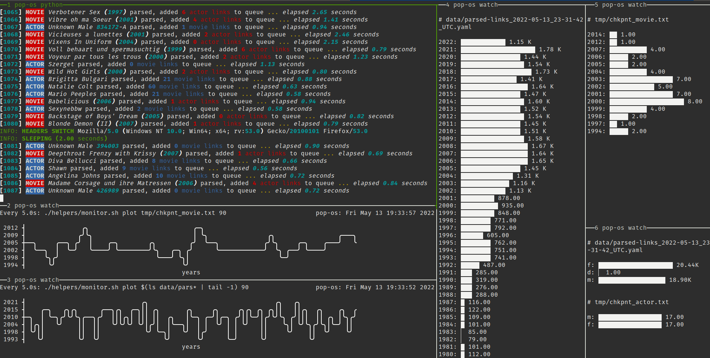

# Scraping

- To keep things organized, I created a scraping environment instead of grouping the whole project into one environment for both analysis and scraping. Please see the `environment` file. Originally I was trying `scrapy` to attempt scraping but I believe the site loaded the table dynamically and using the normal `requests` package was suffficent, but `scrapy` did not handle that well.
- To get some seeds (pun *maybe* intended), I basically searched for some normal keywords to get to some tables, then went to `Inspect > Console`, and used some of the gist of the contents (sometimes some modifications) of the `*.js` files (roughly inspired by [this](https://gist.github.com/timvisee/55efa2a603c90ff1254905373258d490)) in the `helpers` folder. Then I pasted them into either `tmp/chkpnt_actor.txt` or `tmp/chkpnt_movie.txt` files accordingly.
- Then just use `python iafd-crawl.py`
- During scraping, I ran some commands in `helpers/cmd.md` to monitor whether there were "biases" in the movie years and performers' gender then used `config/filters.yaml` to filter suppress probabilistically certain years or gender (basically by igrnoting) to balance out. In retrospect, I should have saved such filtered out entries somewhere else and then come back.
- Here's what the "monitoring" process looks like:

